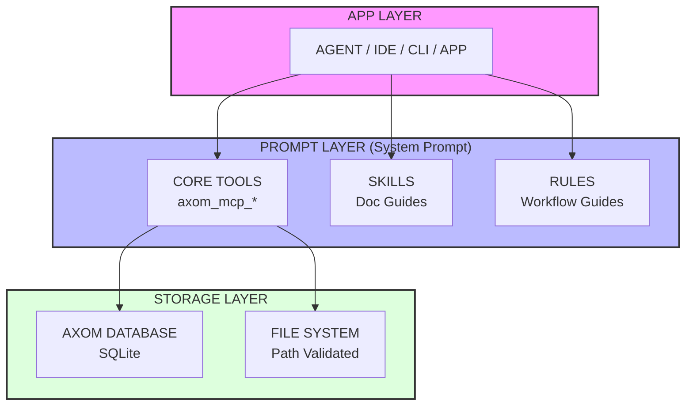

# Axom Agent Guide

Axom is a Model Context Protocol (MCP) server.
Provides AI agents with persistent memory, tool abstraction,
and chain-reaction capabilities.

## Architecture Overview

### 1. Core MCP Tools

| Tool | Purpose |
| :--- | :--- |
| `axom_mcp_memory` | Challenges itself, other agents, and users to re-think and seek optimal solutions; improves creativity and focus |
| `axom_mcp_exec` | File operations and shell commands |
| `axom_mcp_analyze` | Code analysis and debugging |
| `axom_mcp_discover` | Map environment and capabilities |
| `axom_mcp_transform` | Convert data formats |

### 2. Skills (Agent Guides)

Documentation guides for optimal agent behavior.
Located in `docs/agents/skills/`.

### 3. Rules (Mandatory Patterns)

Mandatory workflow patterns for agents.
Located in `docs/agents/rules/`.

## ⚠️ CRITICAL: Start Here

**Read in order:**

1. `docs/agents/INDEX.md` - Quick navigation and decision guide.
2. `docs/agents/skills/axom-memory/SKILL.md` - Core memory workflow (MANDATORY).
3. `docs/agents/rules/axom-rule.md` - Required agent behavior.

## Standard Agent Workflow

| Step | Action |
| :--- | :--- |
| 1. Search memories | `axom_mcp_memory action="search"` to find prior context. |
| 2. Discover context | `axom_mcp_discover` if more information needed. |
| 3. Analyze | `axom_mcp_analyze` to debug or review code. |
| 4. Execute | `axom_mcp_exec` to make changes or run commands. |
| 5. Store insights | `axom_mcp_memory action="write"` at task end. |

## Quick Reference

| Concept | Location |
| :--- | :--- |
| Navigation | `docs/agents/INDEX.md` |
| Memory workflow | `docs/agents/skills/axom-memory/SKILL.md` |
| Required rules | `docs/agents/rules/axom-rule.md` |
| Troubleshooting | `docs/agents/TROUBLESHOOTING.md` |

---
*Axom MCP: Persistent Memory for AI Agents*
