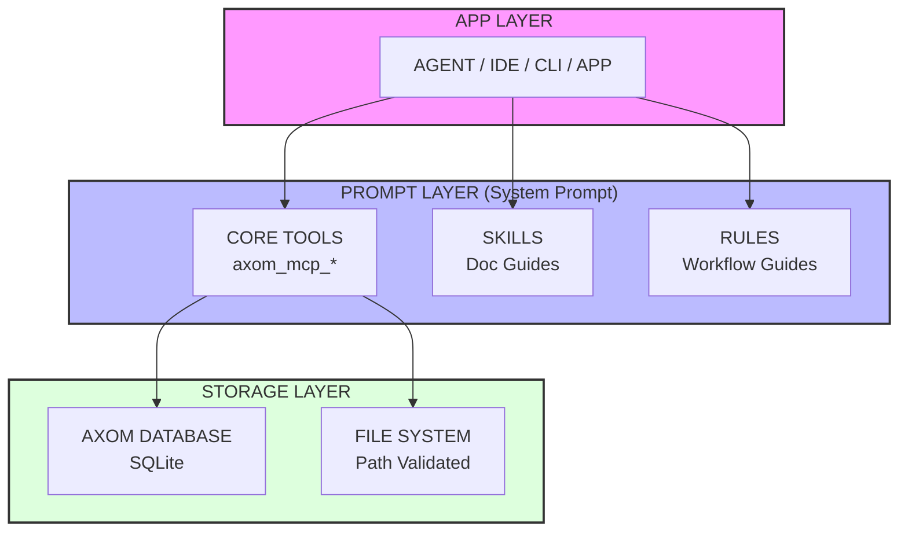

# Axom Agent Guide

Axom is a Model Context Protocol (MCP) server.
Provides AI agents with persistent memory, tool abstraction,
and chain-reaction capabilities.

## Focus on what to do, not what to avoid

```text
Never reference (negative) user commands in comments or documentation.
  Example:
  User: "Use tool Y instead of X"

  Correct Comment: "# Use tool Y"
  Incorrect Comment: "# Use tool Y (not X)"
```

## TODO Placeholder
If you aren't sure about something, leave a TODO as placeholder.
Continue implementing the rest of your task and include the TODO in your output.
```py
Tool X: [x]
Tool Y: [x]
Tool Z: # TODO: Did the user mean tool Z or tool Q
Tool W: [x]
```

## Architecture Overview



### 1. Core MCP Tools

| Tool                 | Purpose                               |
| :------------------- | :------------------------------------ |
| `axom_mcp_memory`    | Store and retrieve persistent context |
| `axom_mcp_exec`      | Commands with pre-meditated chaining  |
| `axom_mcp_analyze`   | Code analysis and debugging           |
| `axom_mcp_discover`  | Map the unknown before taking action  |
| `axom_mcp_transform` | Convert data formats between formats  |

### 2. Skills (Agent Guides)

Documentation guides for optimal agent behavior.
Located in `docs/agents/skills/`.

### 3. Rules (Mandatory Patterns)

Mandatory workflow patterns for agents.
Located in `docs/agents/rules/`.

## Setting Up Skill Discovery for Axom Agents

To give every agent session access to tools and skill guides, use the following.

### 1. Enable skill discovery in agent context

In your agent’s system prompt or bootstrap context (e.g. project `AGENTS.md`, Cursor rules, or Codex config), include:

- **On initialization**, call `axom_mcp_discover` with `domain: "tools"` to enumerate MCP tools and their parameters.
- **Load the skill index** by reading `docs/agents/INDEX.md` (or the agent’s skills directory, e.g. `~/.cursor/skills` after `make agents`). Use it for contextual lookup and when chaining tools.

### 2. Ensure Axom MCP and skills are installed

- **MCP**: Axom must be registered as an MCP server (see [README](README.md#client-configuration)). No extra “tools section” is needed. Tools are exposed by the server.
- **Skills**: Run `make agents` from the repo root to install rules and skills into your agent (Cursor, Codex, etc.). Skills are copied into the agent’s skills path from `docs/agents/skills/`.

### 3. Documentation reference

- **Canonical index**: `docs/agents/INDEX.md` — tool decision tree, quick reference, and links to all skills.
- **Skill guides**: `docs/agents/skills/` — one directory per skill with a `SKILL.md` guide.

### Example discovery for agent context

```text
At session start:
1. Call axom_mcp_discover with {"domain": "tools"} and load the returned tool list into working memory.
2. Read docs/agents/INDEX.md (or the installed skills index) and integrate the skill list and workflow into working memory.
```

This keeps agents aligned with the current toolchain and skill set. For more detail, see [docs/agents/skills/README.md](docs/agents/skills/README.md) and [docs/agents/skills/axom-skills/SKILL.md](docs/agents/skills/axom-skills/SKILL.md).

## Standard Agent Workflow

| Step                | Action                                                   |
| :------------------ | :------------------------------------------------------- |
| 1. Search memories  | `axom_mcp_memory action="search"` to find prior context. |
| 2. Discover context | `axom_mcp_discover` if more information needed.          |
| 3. Analyze          | `axom_mcp_analyze` to debug or review code.              |
| 4. Execute          | `axom_mcp_exec` to make changes or run commands.         |
| 5. Store insights   | `axom_mcp_memory action="write"` at task end.            |

## Quick Reference

| Concept         | Location                                  |
| :-------------- | :---------------------------------------- |
| Navigation      | `docs/agents/INDEX.md`                    |
| Memory workflow | `docs/agents/skills/axom-memory/SKILL.md` |
| Required rules  | `docs/agents/rules/axom-core.md`          |
| Troubleshooting | `docs/agents/TROUBLESHOOTING.md`          |

---
*Axom MCP: Persistent Memory & Async task orchestration for AI Agents*
